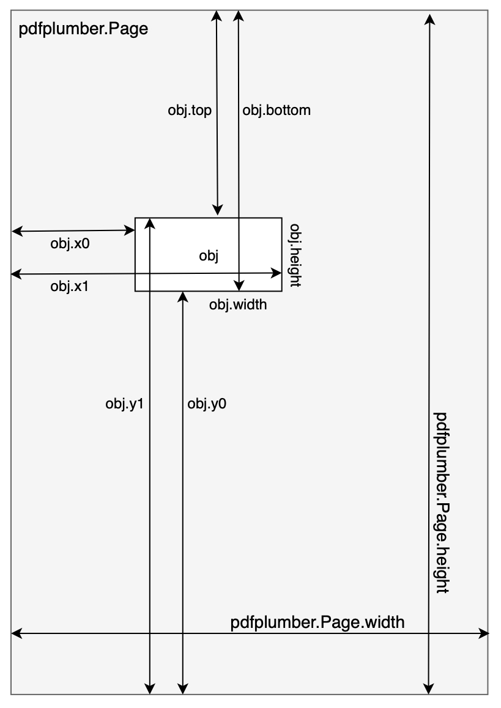

# DePDF


An ultimate pdf file disintegration tool. DePDF is designed to extract tables and paragraphs into structured markup language [eg. html] from embedding pdf pages. You can also use it to convert pdf page or pdf to html.

Built on top of [`pdfplumber`](https://github.com/jsvine/pdfplumber)

Checkout automatically generated [documentation](https://depdf.readthedocs.io/en/latest/index.html) if you wish.


# Table of Contents
[toc]


# Installation
`pip install depdf`

# Example
```python
from depdf import DePDF
from depdf import DePage

# general
with DePDF.load('test/test.pdf') as pdf
    pdf_html = pdf.to_html
    print(pdf_html)

# with dedicated configurations
c = Config(
    debug_flag=True,
    verbose_flag=True,
    add_line_flag=True
)
pdf = DePDF.load('test/test.pdf', config=c)
page_index = 23  # start from zero
page = pdf_file.pages[page_index]
page_soup = page.soup
print(page_soup.text)
```


# APIs
| **functions** | usage |
|:---:|---|
| `extract_page_paragraphs` | extract paragraphs from specific page |
| `extract_page_tables` | extract tables from specific page |
| `convert_pdf_to_html` | convert the entire pdf to html | 
| `convert_page_to_html` | convert specific page to html | 


# In-Depth

## In-page elements
* Paragraph
    + Text
    + Span
* Table
    + Cell
* Image

## Common properties
| **property & method** | explanation |
|:---:|---|
| `html` | converted html string |
| `soup` | converted beautiful soup |
| `bbox` | bounding box region | 
| `save_html` | write html tag to local file| 

## DePDF HTML structure
```html
<div class="{pdf_class}">
    %for <!--page-{pid}-->
        <div id="page-{pid}" class="{page_class}">
            %for {in_page_elements} endfor%
        </div>
    endfor%
</div>
```

## DePage HTML element structure

### Paragraph
```html
<p>
    {text-content}
    <span> {span-content} </span>
    ... 
</p>
```

### Table
```html
<table>
    <tr>
        <td> {cell_0_0} </td>
        <td> {cell_0_1} </td>
        ...
    </tr>
    <tr colspan=2>
        <td> {merged_cell_1_0} </td>
        ...
    </tr>
    ...
</table>
```

### Image
```
</img>
```

# Configuration encyclopedia

## PDF 解析

| **keyword** | detail | default |
|:---|---|---|
| logo_flag | 是否分析不同页面共有的水印信息 | `True` |
| header_footer_flag | 是否分析不同页面共有的页眉页脚信息 | `True` |
| temp_dir_prefix | 是否分析不同页面共有的页眉页脚信息 | temp_depdf |
| unique_prefix | 生成临时文件图片的文件名称（一般会自动生成） | |

## 页面解析

| **keyword** | detail | default |
|:---|---|---|
| table_flag | 是否解析表格 | `True` |
| paragraph_flag | 是否解析段落 | `True` |
| image_flag | 是否解析图片 | `True` |
| resolution | debug 模式下生成页面预览图的分辨率 | 300 |
| main_frame_tolerance | 识别页面内主要文字区域的阈值 | |
| x_tolerance | 识别页面内文本行的横向阈值 | |
| y_tolerance | 识别页面内文本行的纵向阈值 | |
| page_num_top_fraction | 识别页面内页码信息上边界距离和页面的高度比例 | |
| page_num_left_fraction | 识别页面内页码信息 | |
| page_num_right_fraction | 识别页面内页码信息 | |

## 页面分栏识别

| **keyword** | detail | default |
|:---|---|---|
| multiple_columns_flag | 是否识别多栏页面 | `True` |
| max_columns | 识别多栏页面栏数上限 | 3 |
| column_region_half_width | 识别多栏页面栏分界宽度 | |
| min_column_region_objects | 识别多栏页面栏分界内的对象数目上限 | |

## 字符提取

| **keyword** | detail | default |
|:---|---|---|
| char_overlap_size | 判断字符是否重叠的阈值 | |
| default_char_size | 默认的字符大小 | |
| char_size_upper | 探测到字符大小的上限 | |
| char_size_lower | 探测到字符大小的下限 | |

## 表格提取

| **keyword** | detail | default |
|:---|---|---|
| dotted_line_flag | 是否分析页面内的虚线 | |
| curved_line_flag | 是否分析页面内的曲线 | |
| snap_flag | 是否合并表格线段| |
| add_line_flag | 是否为表格增加横竖线 | |
| min_double_line_tolerance | 判断线段是否为临近双线的距离下限 | |
| max_double_line_tolerance | 判断线段是否为临近双线的距离上限 | |
| vertical_double_line_tolerance | 判断线段是否为垂直临近双线的距离上限 | |
| table_cell_merge_tolerance | 合并单元格的宽度差别容错值 | |
| skip_empty_table | 是否忽略空白表格 | |
| add_vertical_lines_flag | 是否增加竖线 | |
| add_horizontal_lines_flag | 是否增加横线 | |
| add_horizontal_line_tolerance | 增加横线的阈值 | |
 
 ## 图片提取

| **keyword** | detail | default |
|:---|---|---|
| min_image_size | 识别图片的边长最小像素值 | 80 |
| image_resolution | 提取图片的分辨率 | 300 |

## 页眉页脚识别

| **keyword** | detail | default |
|:---|---|---|
| default_head_tail_page_offset_percent | 页眉页脚的错位比例 | |

## 日志输出

| **keyword** | detail | default |
|:---|---|---|
| log_level | 日志的级别 | `WARNING` |
| verbose_flag | 是否输出运行中间过程信息 | `False` |
| debug_flag | 是否打开调试（生成解析对象的边界信息）| `False` |

## 生成的网页标签

| **keyword** | detail | default |
|:---|---|---|
| span_class | 生成 HTML 的 span 节点的 class | pdf-span |
| paragraph_class | 生成 HTML 的 p 节点的 class | pdf-paragraph |
| table_class | 生成 HTML 的 table 节点的 class | pdf-table |
| pdf_class | 生成 HTML 的最外层 pdf div 节点的 class | pdf-content |
| image_class | 生成 HTML 的 img 节点的 class | pdf-image |
| page_class | 生成 HTML 的 page div 的 class | pdf-page |
| mini_page_class | 生成 HTML 的 mini-page div 的 class | pdf-mini-page |


# Update log

* `2020-03-18` add support for multiple-column PDFs
* `2020-03-12` initial depdf release


# Appendix

## todo

* [x] add support for multiple-column pdf page
* [x] better table structure recognition
* [x] recognize embedded objects inside page elements

## Project overview

```bash
.
├── depdf
│   ├── components
│   │   ├── image.py
│   │   ├── paragraph.py
│   │   ├── span.py
│   │   ├── table.py
│   │   └── text.py
│   ├── api.py
│   ├── base.py
│   ├── config.py
│   ├── error.py
│   ├── log.py
│   ├── page.py
│   ├── page_tools.py
│   ├── pdf.py
│   ├── pdf_tools.py
│   ├── settings.py
│   ├── utils.py
│   └── version.py
├── test
│   ├── test.html
│   ├── test.pdf
│   ├── test.py
│   └── test_mc.pdf
├── LICENSE
├── README.md
├── annotations.jpg
└── pyproject.toml

4 directories, 33 files

```

## DePage element denotations
> Useful element properties within page



